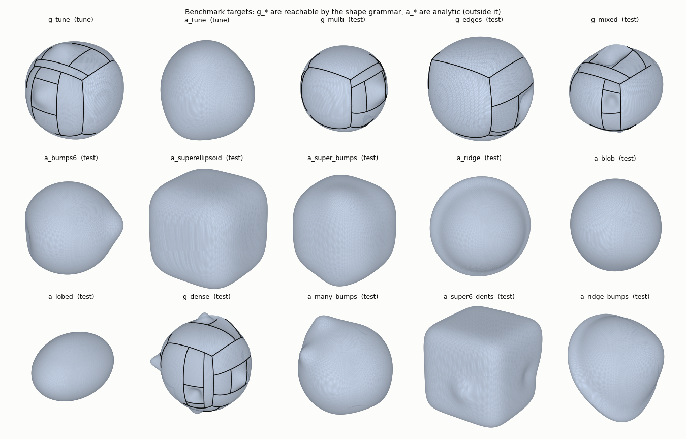
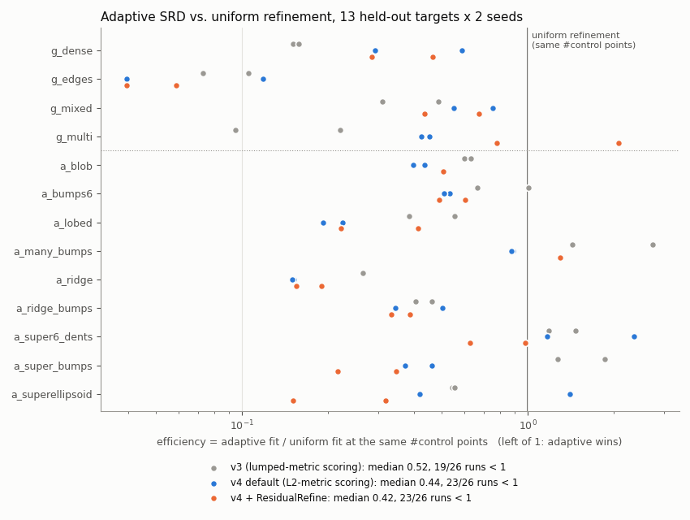
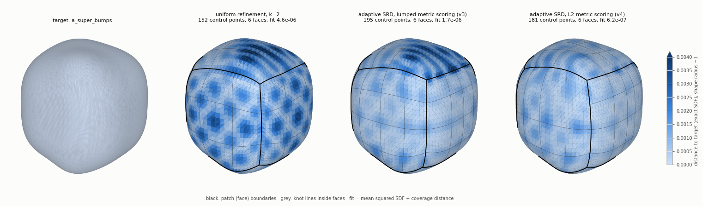
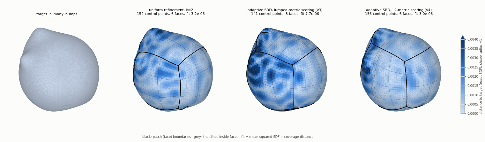
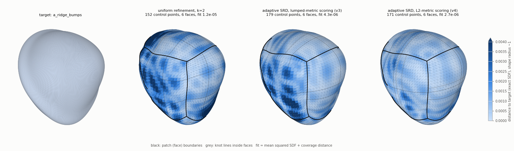
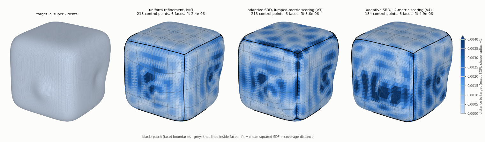
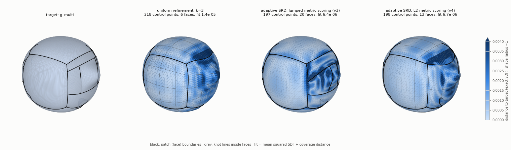

# Results

All numbers below come from an RTX 4080 in float64. `fit` is the exact narrow-band SDF² (area-weighted)
plus coverage², evaluated on a dense sampling that is independent of the optimizer. *Efficiency* is
an adaptive run's fit divided by the fit of fixed uniform refinement at the same number of control
points, interpolated log-log along the uniform curve k = 0..5. Below 1 means adaptive is better at
equal size.

## 1. Closing the gap to uniform refinement (v4, current code)

v3 left adaptive SRD behind uniform refinement on shapes with many small features spread over a
boxy body (`a_super_bumps`, `a_super6_dents`, `a_many_bumps`). Diagnosis, in order:

- **Not the simplifications or the per-round cap.** Turning simplifications off, lowering
  `eps_remove` to 1e-3 and allowing 3 refinements per round left the fit unchanged or worse
  (removals actually improve fit per control point), and the cap never bound.
- **Refinements were starved.** After round 3 every FaceRefine cost 120-200 control points, its
  predicted one-step gain was below its birth cost, and the cheap rewrites (carrier knots)
  predicted almost nothing. SRD spent the remaining 16 rounds polishing and simplifying.
- **The cause was the scoring metric.** `D = g^T M^{-1} g` used the lumped mass. For bicubic
  patches the lumped mass overstates the mass of oscillatory control modes by up to ~1000x
  (smallest eigenvalue of `diag(m)^{-1/2} M diag(m)^{-1/2}` is about 1e-3), and those are the
  modes an exact refinement adds. Scoring with the consistent mass `G^T W G` fixes this. Steps
  keep the lumped metric: consistent-mass *steps* sped up uniform fits ~3x but lost on grammar
  targets (less local steps); all four step/score combinations were benchmarked.
- **Optimizer stall (bug).** One face approaching a fold made every step add a self-intersection,
  shrinking the global step to ~1e-14. Fixed by contact freezing: retry the step with that face's
  DOFs frozen (`ContinuousConfig.freeze_contact`).
- **Convergence caveat.** At the 800-step budget no method is converged; uniform k=1 on
  `a_super_bumps` improves 3x with 1600 more steps and then beats k=2. Efficiency compares methods
  at equal budget, not at convergence.

13 held-out targets x 2 seeds, default lambda, 20 rounds x 40 steps + 200 polish. Each run is
compared with uniform refinement run under the same code (`experiments/benchmark_out/v4_lumped`):

| | v3 | **v4 default** | v4 + ResidualRefine |
|---|---|---|---|
| median efficiency | 0.52 | **0.44** | 0.42 |
| runs better than uniform | 19/26 | **23/26** | 23/26 |
| fit vs. v3, analytic targets (geometric mean) | 1 | **0.38** | 0.43 |
| fit vs. v3, grammar targets (geometric mean) | 1 | 1.21 | 1.22 |

- **Weak targets**: `a_many_bumps` went from 1.4-2.7 to 0.89 (both seeds about 2.8e-6);
  `a_super_bumps` from 1.3-1.9 to 0.46 and 0.14. `a_super6_dents` remains the hardest shape:
  1.17 and 2.34.
- **Median control-point saving** 1.35x (23 runs inside the uniform range).
- **Grammar targets** lost a little: `g_mixed` (both seeds 1.7x worse) and `g_multi` seed 1;
  `g_edges` improved 2x.
- **ResidualRefine** (new grammar rule: knots at residual quantiles instead of bisection) ties
  the default. It helps the superellipsoid family and hurts `g_multi`, so it stays opt-in.
- **Single-target baseline** (section 3) is unchanged within seed noise.

### Example fits

Each figure: the target, uniform refinement with the closest control-point count, and SRD with
v3 and v4 scoring (same seed, colored by distance to the target; black lines are patch
boundaries, grey lines are knots). These are single runs, and GPU runs are not bit-reproducible:
the aggregate above is the evidence, the pictures are illustrations. `a_super6_dents` is shown
on an unfavorable draw where v4 lost.

## 2. Held-out benchmark v3 (`experiments/benchmark.py --split test --tag v3`)

Targets:
- **4 grammar targets**, reachable by construction: 1–4 interior and near-edge features, edge
  ridges, and corner features.
- **9 analytic targets**, outside the grammar: multi-bump spheres, superellipsoids (n = 4 and 6,
  with and without dents), a tilted ridge, a low-frequency blob, a lobed ellipsoid, and 12 narrow
  bumps.

Every method gets 20 rounds × 40 steps plus a 200-step exact-SDF polish.

| adaptive (mode C) vs. uniform at equal size | v2 (before the fixes below) | **v3 (final)** |
|---|---|---|
| default λ = 1e-6, 3 seeds: median efficiency (runs better) | 1.18 (18/38) | **0.49 (28/39)** |
| λ = 1e-7, 2 seeds | 1.44 (12/25) | **0.37 (20/24)** |
| λ = 3e-8, 2 seeds | 1.14 (7/15) | **0.47 (19/20)** |
| grammar targets, all λ | 0.21–0.31 | **0.24 (25/25)** |
| analytic targets, all λ | 2.8–3.3 | **0.57 (42/58)** |

- **Control-point saving**: the median is 1.39×. That's how many more control points uniform
  refinement needs to match the adaptive fit, over the runs inside the uniform curve's range.
- **Beating uniform outright**: 20 of 91 adaptive runs reach a lower fit than the *finest* uniform
  model (k = 5, 386 control points).
- **Biggest reversal**: `a_superellipsoid` went from 9–47× *worse* than uniform (v2) to 0.53–0.75
  (v3).
- **Still weaker than uniform**:
  - `a_many_bumps` at λ ≥ 1e-7: efficiency 1.4–2.7;
  - `a_super6_dents` at λ ≥ 1e-7: efficiency 1.2–5.6;
  - one seed of `a_super_bumps` at the default λ: efficiency 3.2.

  These shapes have many small features spread over a boxy body, so neither purely global nor
  purely local refinement fits them well.
- **One outlier**: `g_dense`, λ = 3e-8, seed 0 ended at 3.6e-5 with 655 control points; one target
  region was never covered (max coverage distance 0.052). A rerun of the same configuration gave
  3.0e-6 with 475 control points. GPU runs are not bit-reproducible: atomic `index_add` and sparse
  products reorder floating-point sums, so trajectories diverge.

Full per-target tables are in `experiments/benchmark_out/report_v3.md`; the interactive Pareto
charts are in `experiments/benchmark_out/dashboard.html`.

### What changed between v2 and v3 (found with the benchmark)

1. **Optimizer freeze (bug).** A rewrite re-samples the validity-check tessellation. That can
   reveal a small fold that already existed, and every later step inherited it, so the absolute
   "no self-intersection" rule rejected all motion: `a_ridge_bumps` ended *worse than the coarse
   model*. Fixed with a monotone rule (a step may not add intersections) plus an SRD acceptance
   gate. That run goes from 1.3e-4 with 536 control points to 1.7e-5 with 139.
2. **Discontinuous coverage loss (bug).** Closest-triangle candidates came from the 6 nearest
   centroids in a float32 search. That missed large triangles and broke near-ties by rounding
   noise, trapping Armijo at step sizes around 1e-13. Fixed with centroid + vertex-star candidates
   in float64.
3. **Step size carried across rewrites** (fixed: it now resets after accepted rewrites).
4. **Myopic window commitment (policy).** On globally smooth misfit, local windows have the best
   *immediate* gain per DOF, and SRD never recovered the face-wide refinement it needed. An exact
   split applied to a converged model still improves it, which rules out an optimization
   pathology. The fix is the **residual-adaptive scale**: when the residual is spread (area holding
   half its energy > 0.04, a threshold set on the tuning targets only), propose global refinements;
   otherwise local windows.

Earlier tuning-set findings, still in the code:
- boundary refinement for LocalRefine windows (the window seams held 60% of the error on smooth
  shapes);
- FaceRefine;
- ratio (gain per DOF) ranking;
- the exact-SDF polish;
- the crease penalty stays off: no consistent gain across seeds.

## 3. Single-target baseline (`experiments/adaptive_refinement.py`)

The cube-sphere with one localized bump, as in the original specification. See
`experiments/output/metrics.md`; `--record` writes `experiments/output/viewer.html`, an
interactive replay of the method-C runs. Numbers for the v4 code:

| method | fit (median of 3 seeds) | control pts | faces | total objective | runtime / run |
|---|---|---|---|---|---|
| fixed coarse | 1.54e-4 | 56 | 6 | 2.19e-4 | 18 s |
| fixed uniform k=3 | 5.46e-6 | 218 | 6 | 2.34e-4 | 27 s |
| adaptive, naive scoring (A) | 1.54e-4 (identical to coarse) | 56 | 6 | 2.19e-4 | 35 s |
| adaptive, marginal, no birth cost (B) | 1.20e-6 (1.2e-6 - 1.5e-6) | 199 | 9 | 2.13e-4 | 58 s |
| **adaptive, marginal + birth (C)** | **1.98e-6** (1.7e-6 - 2.4e-6) | **92** | 10 | **1.08e-4** | 55 s |
| adaptive C, uniform proposals | 2.33e-6 | 126 | 10 | 1.43e-4 | 61 s |

Runtimes were measured with two other benchmark jobs sharing the GPU. C has a 2.8x lower fit than
uniform k=3 with 42% of its control points, and the best total objective.
Naive scoring never refines; B over-refines and churns.

## 4. FEM: compliance-driven shape optimization (`experiments/compliance_shape.py`)

- **Setup**: a cantilever beam, a rounded box 2.8 × 0.9 × 0.9, clamped at its left end and loaded
  downward at the right tip.
- **Mesh and solve**: a fixed 31 × 12 × 12-cell grid with 16k DOFs, solved by Jacobi-PCG on the
  GPU.
- **Objective**: normalized compliance plus a volume penalty asking for 80% of the initial volume.
- **Run**: 150 continuous steps, 22 s.

| | volume | compliance |
|---|---|---|
| initial beam | 1.00 V0 | 1.00 C0 |
| uniform scaling to 0.8 V0 (naive baseline) | 0.80 V0 | 3.38 C0 |
| **optimized** | **0.81 V0** | **0.34 C0** |

The optimized beam is **10× stiffer** than naive scaling at the same volume. Its shape is the
classic optimal cantilever: deep at the clamped root, where the bending moment is largest,
tapering toward the loaded tip. The root also grips the support region better. Gradients flow
control points → proxy → soft occupancy → SIMP moduli → adjoint compliance; they are verified
against finite differences in `tests/test_fem.py`.

## 5. Performance

- **Device port**: 5-round SRD on the bump target went from 16.5 s (CPU) to 8.4 s (GPU), and the
  test suite from 78 s to 42 s, both measured before later additions.
- **Code-review fixes**, hot paths, old vs. new implementation on identical inputs:

| hot path | old | new | speedup |
|---|---|---|---|
| sparse vs. dense Kronecker products for sample operators | 35.7 ms | 22.5 ms | 1.6× |
| DOF-map face rows (cached run matrices) | 51.5 ms | 22.7 ms | 2.3× |
| state copy + DOF-map access (map reused) | 4.1 ms | 1.4 ms | 2.9× |
| scoring one exact refinement (one forward pass fewer) | 323 ms | 276 ms | 1.2× |
| continuous step with 6 backtracking trials (self-intersection test last) | 258 ms | 224 ms | 1.2× |
| face refit for KnotRemove/MergeFace (separable least squares) | 1.2 ms | 0.9 ms | 1.3× |

- **End to end** (same harness, same 33 runs, v1 → v2): 1.13× for adaptive runs, 1.34× for fixed
  runs. v1 was partly slowed by concurrent CPU test runs, so the fixed-run figure is an upper bound.
- **Cost of the robust distance search**: the float64 centroid + star candidates made coverage
  costlier. Fixed uniform runs took 1.9× longer in total in v3 than in v2 (2866 s vs. 1526 s);
  adaptive runs were almost unchanged (median 65 s vs. 68 s per run). A two-stage search fixed this: a float32 search over-fetches 2k
  candidates, and exact float64 distances re-rank them. Coverage evaluation went from 15.9 ms to
  6.7 ms and loss + gradient from 25 to 15 ms. Uniform k=3 / k=5 runs are back to 20 s / 31 s
  (v2: 18 s / 26 s; v3: 32 s / 54 s), with identical fits. Continuity was verified: 200 random
  1e-9 perturbations of a refined, merged structure change the loss by at most 1.6e-11.
